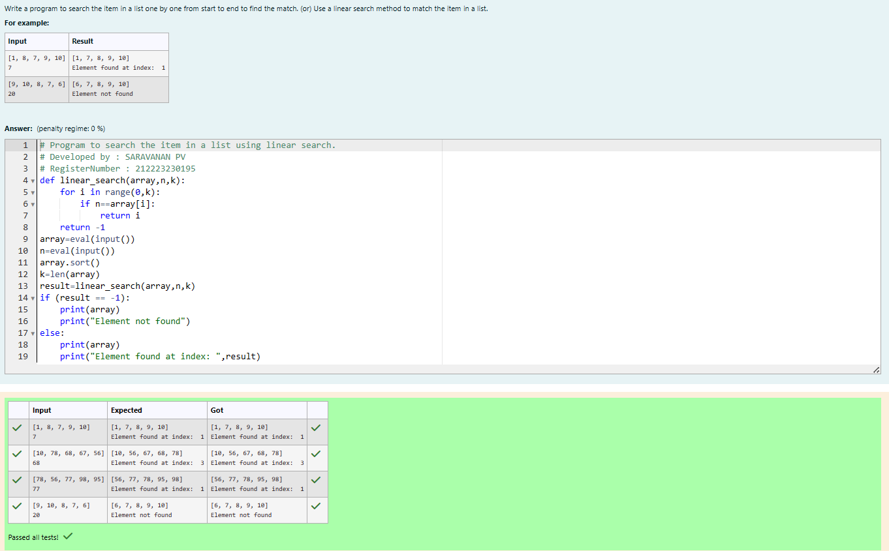
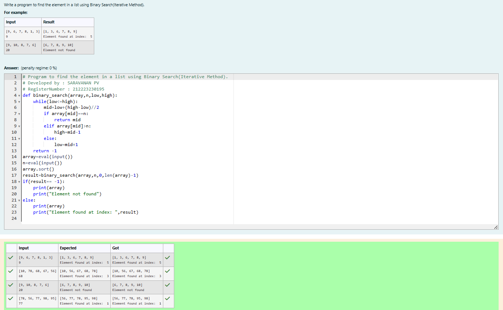
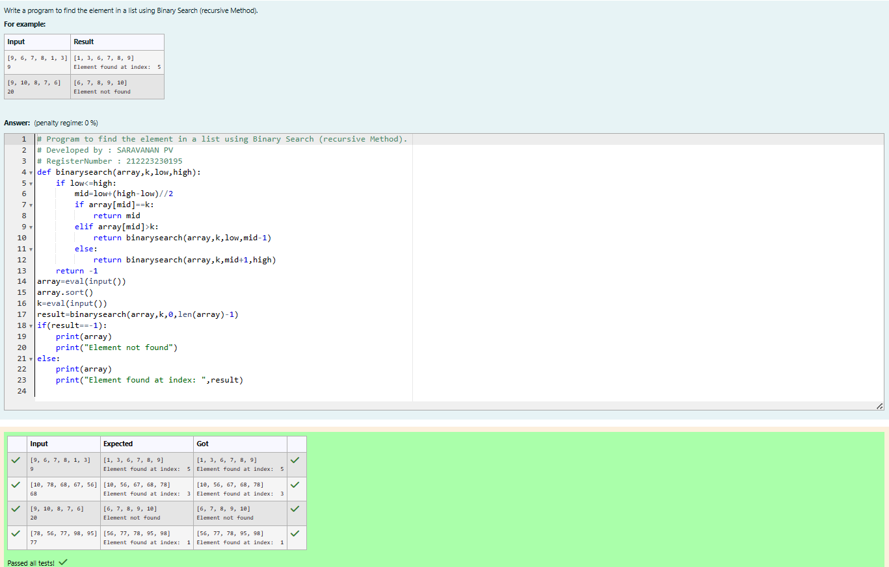

# Linear Search and Binary search

## Aim:

To write a program to perform linear search and binary search using python programming.

## Equipment’s required:

1. Hardware – PCs
2. Anaconda – Python 3.7 Installation / Moodle-Code Runner

## Algorithm:

## Linear Search:

1. Start from the leftmost element of array[] and compare k with each element of array[] one by one.
2. If k matches with an element in array[] , return the index.
3. If k doesn’t match with any of elements in array[], return -1 or element not found.

## Binary Search:

1. Set two pointers low and high at the lowest and the highest positions respectively.
2. Find the middle element mid of the array ie. arr[(low + high)/2]
3. If x == mid, then return mid.Else, compare the element to be searched with m.
4. If x > mid, compare x with the middle element of the elements on the right side of mid. This is done by setting low to low = mid + 1.
5. Else, compare x with the middle element of the elements on the left side of mid. This is done by setting high to high = mid - 1.
6. Repeat steps 2 to 5 until low meets high

## Program:

i) #Use a linear search method to match the item in a list.

```python
# Program to search the item in a list using linear search.
# Developed by : SARAVANAN PV
# RegisterNumber : 212223230195
def linear_search(array,n,k):
    for i in range(0,k):
        if n==array[i]:
            return i
    return -1
array=eval(input())
n=eval(input())
array.sort()
k=len(array)
result=linear_search(array,n,k)
if (result == -1):
    print(array)
    print("Element not found")
else:
    print(array)
    print("Element found at index: ",result)


```

ii) # Find the element in a list using Binary Search(Iterative Method).

```python
# Program to find the element in a list using Binary Search(Iterative Method).
# Developed by : SARAVANAN PV
# RegisterNumber : 212223230195
def binary_search(array,n,low,high):
    while(low<=high):
        mid=low+(high-low)//2
        if array[mid]==n:
            return mid
        elif array[mid]>n:
            high=mid-1
        else:
            low=mid+1
    return -1
array=eval(input())
n=eval(input())
array.sort()
result=binary_search(array,n,0,len(array)-1)
if(result== -1):
    print(array)
    print("Element not found")
else:
    print(array)
    print("Element found at index: ",result)


```

iii) # Find the element in a list using Binary Search (recursive Method).

```python
# Program to find the element in a list using Binary Search(recursive Method).
# Developed by : SARAVANAN PV
# RegisterNumber : 212223230195
def binary_search(array, n):
    low = 0
    high = len(array) - 1
    while low <= high:
        mid = (low + high) // 2
        if array[mid] == n:
            return mid
        elif array[mid] < n:
            low = mid + 1
        else:
            high = mid - 1
    return -1

array = eval(input())
n = eval(input())
array.sort()
result = binary_search(array, n)
if result == -1:
    print (array)
    print("Element not found")
else:
    print(array)
    print("Element found at index: ", result)


```

## Sample Input and Output

i) #Use a linear search method to match the item in a list.


ii) # Find the element in a list using Binary Search(Iterative Method).



iii) # Find the element in a list using Binary Search (recursive Method).


## Result

Thus the linear search and binary search algorithm is implemented using python programming.
